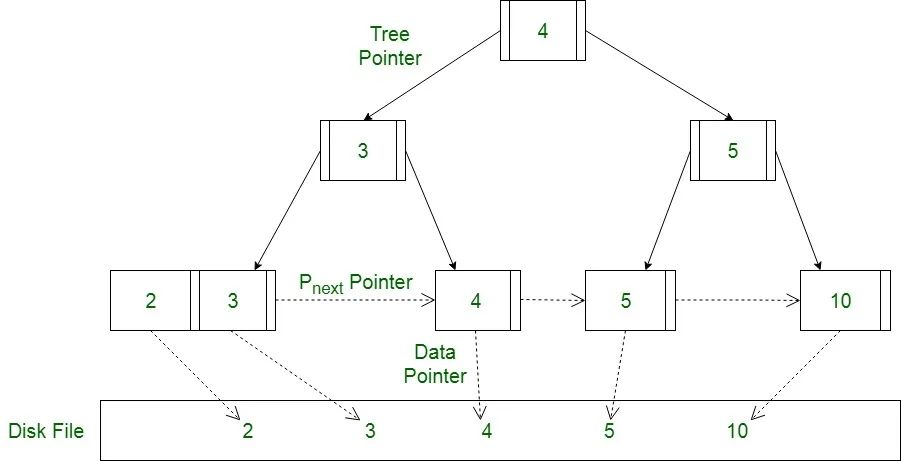
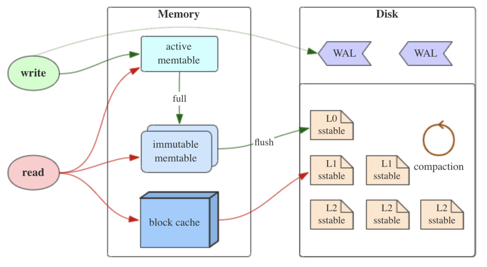

```借鉴rosedb bitcask实现简易数据库存储引擎```

##基本原理：
###1.数据存储模型

B+树

优点：很适合磁盘存储，能够充分利用局部性原理，磁盘预读;  
很低的树高度，能够存储大量数据;  
索引本身占用的内存很小;  
能够很好的支持单点查询，范围查询，有序性查询;  
B+ 树查询性能比较稳定，在写入或更新时，会查找并定位到磁盘中的位置并进行原地操作，注意这里是随机 IO，并且大量的插入或删除还有可能触发页分裂和合并，写入性能一般，因此 B+ 树适合读多写少的场景。

LSM树

LSM Tree（Log Structured Merge Tree，日志结构合并树）其实并不是一种具体的树类型的数据结构，而只是一种数据存储的模型，它的核心思想基于一个事实：顺序 IO 远快于随机 IO。


和 B+ 树不同，在 LSM 中，数据的插入、更新、删除都会被记录成一条日志，然后追加写入到磁盘文件当中，这样所有的操作都是顺序 IO，因此 LSM 比较适用于写多读少的场景。